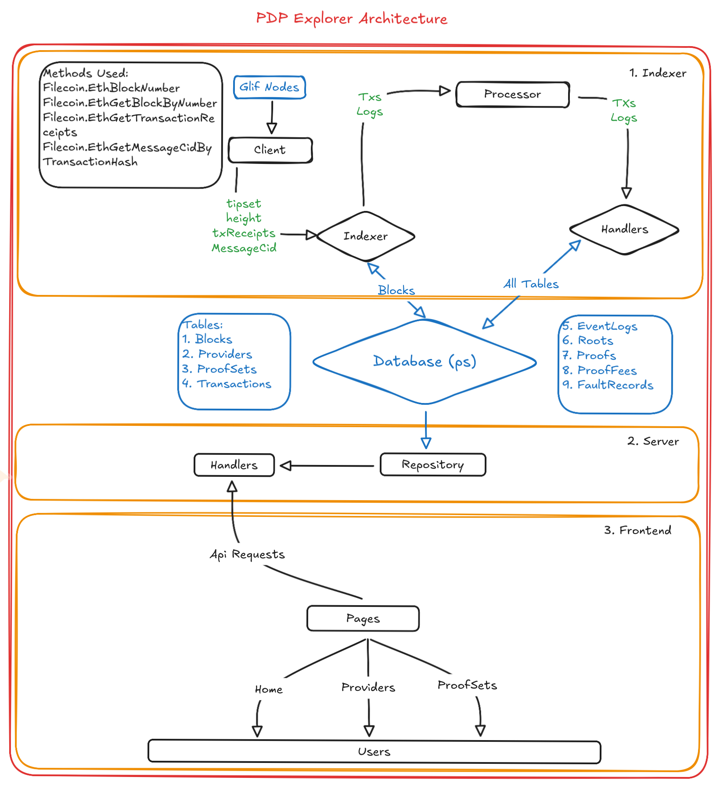

# PDP Explorer Backend Architecture

## Table of Contents
- [Overview](#overview)
- [System Components](#system-components)
- [Database Schema](#database-schema)
- [Architecture Diagram](#architecture-diagram)
- [Integration Points](#integration-points)
- [Data Flow](#data-flow)
- [Configuration](#configuration)
- [Security Considerations](#security-considerations)
- [Maintenance and Operations](#maintenance-and-operations)
- [Future Considerations](#future-considerations)

## Overview

The PDP Explorer backend is composed of two main components:

1. **Indexer Service**: Responsible for processing blockchain events and maintaining the database state
2. **API Server**: Provides REST endpoints for the frontend to query indexed data

## System Components

### 1. Indexer Service

The indexer is responsible for:

- Processing blockchain events in real-time
- Maintaining database consistency during chain reorganizations
- Managing historical data for providers and proof sets

#### Key Components:

- **Block Processor**: Handles block-by-block processing of chain events
- **Event Handlers**: Process specific event types (ProofSetCreated, RootsAdded, etc.)

### 2. API Server

Provides RESTful endpoints for the frontend application.

#### Available Endpoints:

- `GET /providers`: List all providers with pagination
- `GET /providers/:providerId`: Get detailed provider information
- `GET /providers/:providerId/proofsets`: List all proof sets for a provider with sorting and pagination
- `GET /providers/:providerId/activities`: Get activity statistics for a provider
- `GET /proofsets`: List all proof sets with sorting and pagination
- `GET /proofsets/:proofSetId`: Get detailed proof set information
- `GET /proofsets/:proofSetId/event-logs`: Get proof set event logs
- `GET /proofsets/:proofSetId/txs`: Get proof set transactions
- `GET /proofsets/:proofSetId/roots`: Get proof set roots
- `GET /network-metrics`: Get network-wide metrics
- `GET /search`: Search for proof sets and providers

## Database Schema

The system uses PostgreSQL with the following key tables:

### Core Tables

1. **blocks**

   - Tracks processed blocks and their finalization status
   - Used for handling chain reorganizations

2. **providers**

   - Stores provider information with version control
   - Tracks historical changes to provider data

3. **proof_sets**

   - Maintains proof set metadata and status
   - Includes version control for ownership changes

4. **roots**

   - Stores root data associated with proof sets
   - Maintains historical versions for chain reorgs

5. **transactions**

   - Records all relevant blockchain transactions
   - Links to related entities (proof sets, providers)

6. **event_logs**

   - Stores blockchain events and their metadata
   - Used for real-time processing and indexing

7. **proofs**

   - Stores individual proof submissions
   - Used for analytics and provider activity tracking

8. **proof_fees**

   - Records fee information for proof submissions
   - Used for economic analysis

9. **fault_records**
   - Tracks provider fault events
   - Used for provider reliability metrics

## Architecture Diagram



## Integration Points

### Blockchain Integration

- Connects to Filecoin Eth RPC endpoint for blockchain data
- Handles chain reorganizations gracefully
- Recovery process for historical data

### Frontend Integration

- RESTful API with JSON responses
- Pagination support for large datasets
- Sorting and filtering capabilities
- Real-time data consistency

## Data Flow

1. **Event Processing Flow**

   ```
   Blockchain Event → Filecoin Eth RPC Endpoints → Indexer → Processor → Handlers → Database
   ```

2. **Query Flow**

   ```
   Frontend Request → API Server → Database → JSON Response
   ```

3. **Chain Reorganization Flow**
   ```
   Reorg Detection → Block Reversal → Historical Data Cleanup → State Recovery
   ```

## Configuration

The system is configured through environment variables:

- Database connection settings
- Filecoin Eth RPC endpoint configuration
- Other runtime settings

## Security Considerations

- Database connections use SSL/TLS
- API endpoints follow REST best practices
- Environment variables for sensitive configuration
- No direct blockchain write access from API server

## Maintenance and Operations

### Database Maintenance

- Regular cleanup of historical data
- Index optimization for query performance
- Monitoring of database size and growth

## Future Considerations

- **Feature Additions**
  - Event processing pipeline optimization
  - Use Filecoin Method Group instead of Eth
  - Advanced analytics endpoints
  - Historical data API
